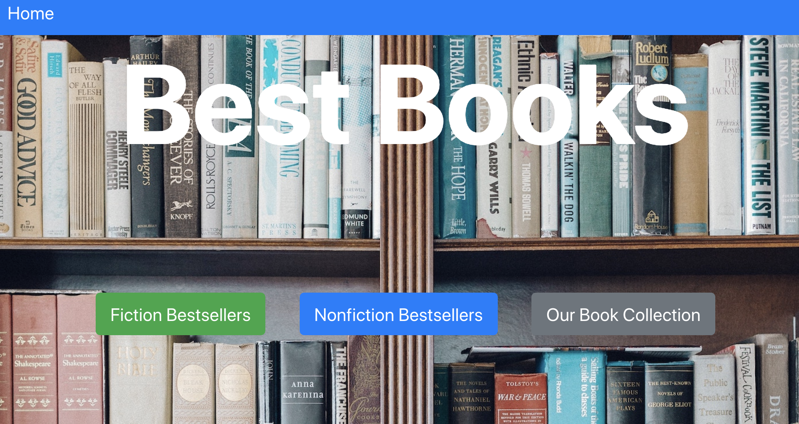
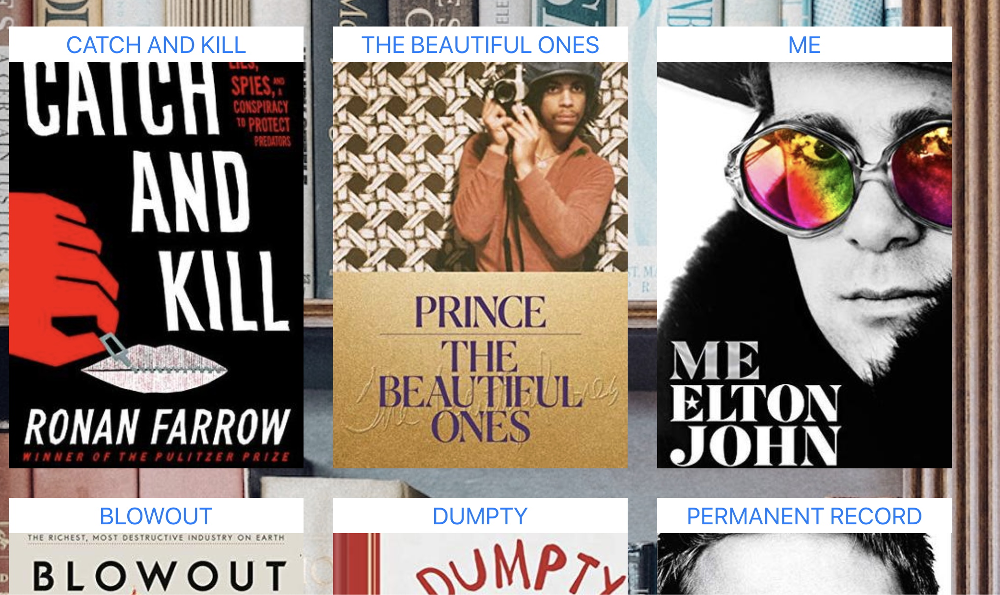
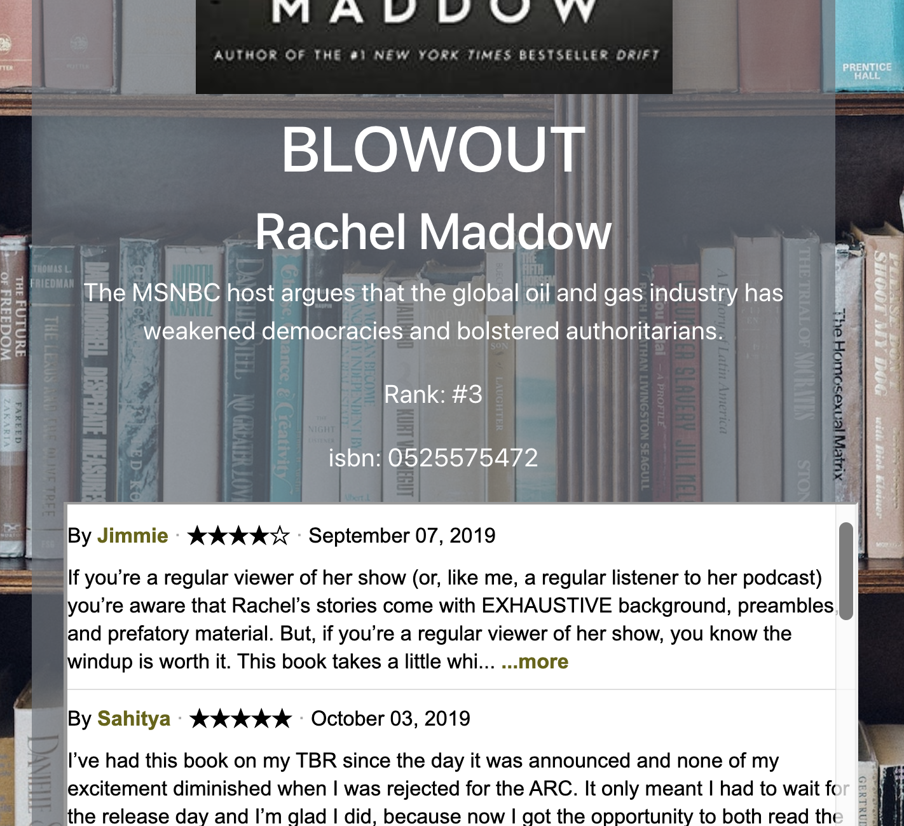

## Best Books App

## Installation

Fork and clone this repository. Run npm install to install dependencies. Run npm start.

## Use

Click a button from the home page to explore the current fiction bestsellers, nonfiction bestsellers, and a collection of user-generated favorite books. Use any of the search fields to find a book by title, author, or rank. In the "Our Book Collection" page, use the input fields to add, edit, search, and delete books from this collection in the bestBooks API.

## Technologies Used

- React
- bestBooks API

## Contribute

- Source code: https://github.com/torykling/Best-Books-App
- Issues: https://github.com/torykling/Best-Books-App/issues
- Source code for bestBooks API: https://github.com/torykling/Best-Books

- See deployed version at: https://elastic-lalande-528edc.netlify.com
